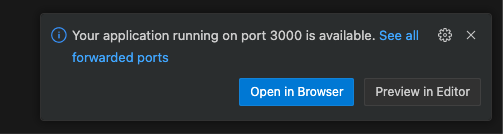
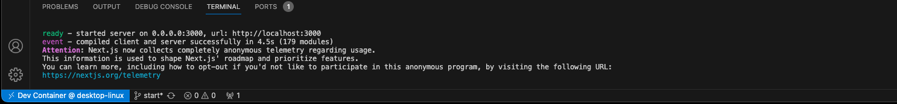
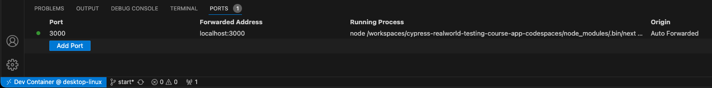
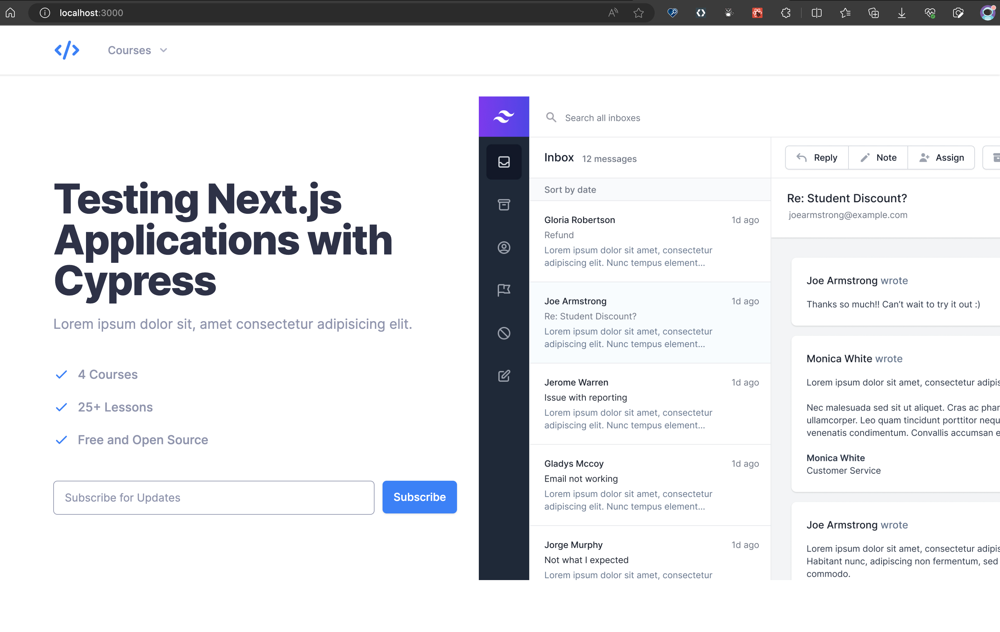
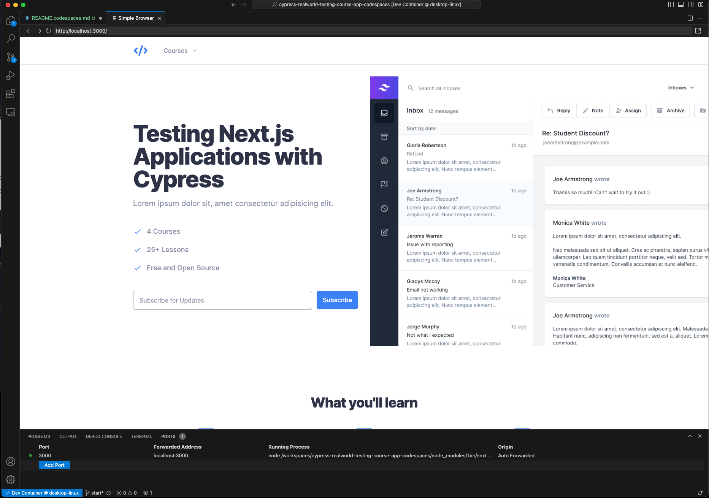
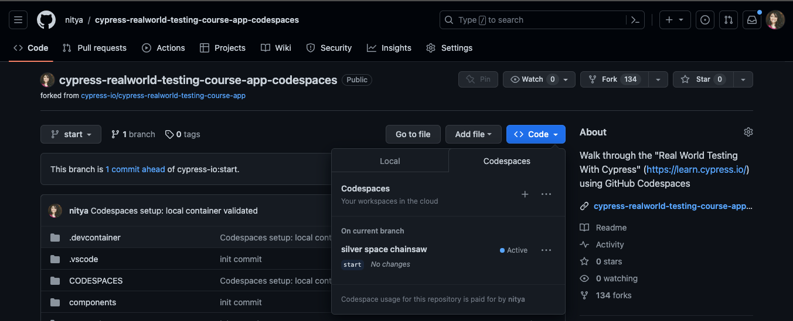
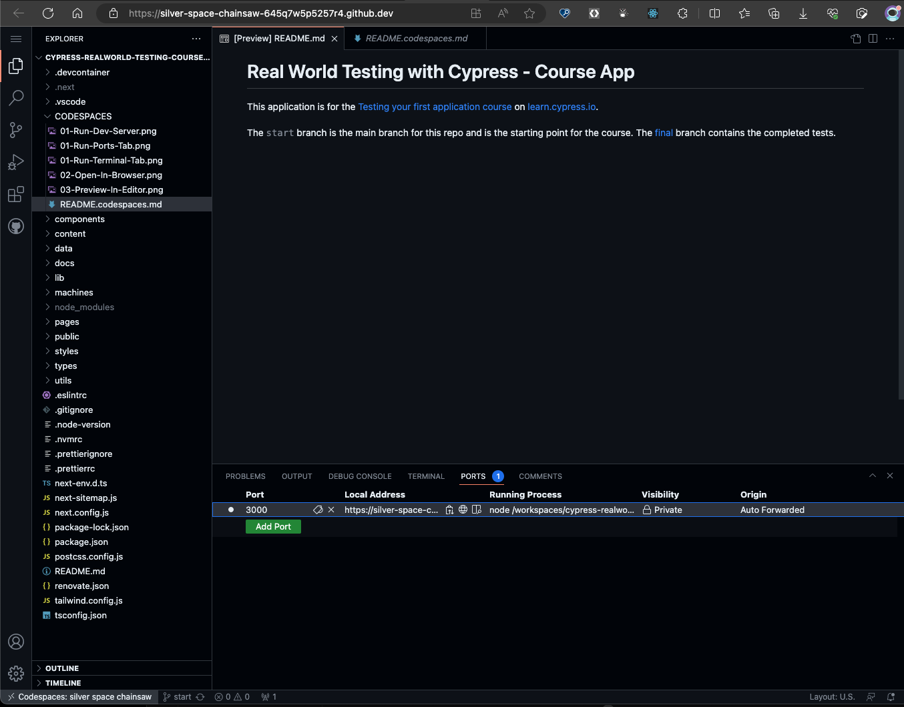
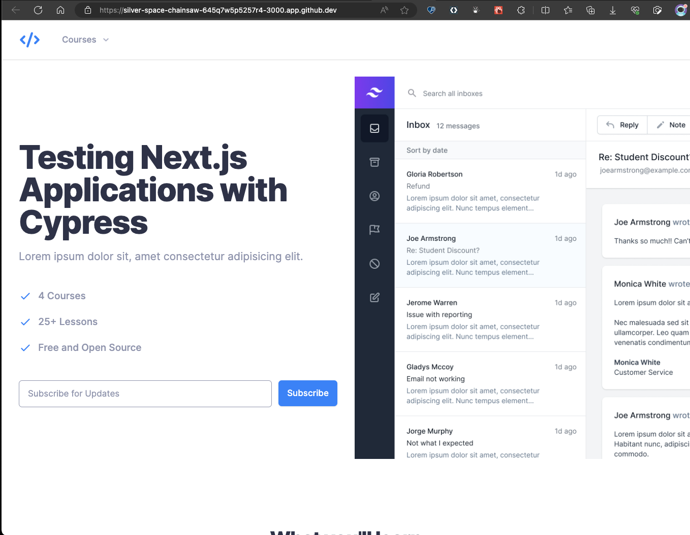
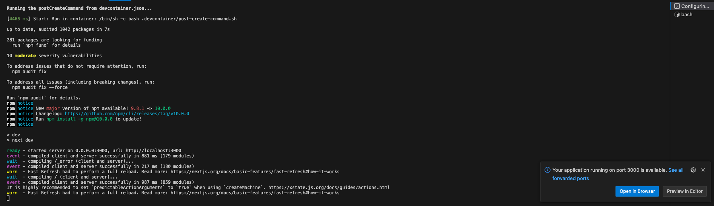

# Real World Testing With Cypress - On GitHub Codespaces

 - The [Cypress Realworld Testing Course App](https://github.com/cypress-io/cypress-realworld-testing-course-app) repository contains the default sample used for the [Real Wotld Testing With Cypress](https://learn.cypress.io/) course. It specifies _Visual Studio Code_ as the preferred environment, but provides manual installation instructions for setup.
 - The primary objective of this fork is to instrument the project with [GitHub Codespaces](https://github.com/codespaces/) (Dev Container) to make that development environment repeatable and consistent by default. 
  - The secondary objective is to create a dedicated [Visual Studio Code Profile](https://code.visualstudio.com/docs/editor/profiles) for Cypress testing that has useful Visual Studio Code Extensions and settings configured for optimal productivity.
 
## 1. Setting Up GitHub Codespaces

The [Real World Testing With Cypress - Course App](https://github.com/cypress-io/cypress-realworld-testing-course-app) is written in TypeScript/JavaScript, and built with [Next.js](https://nextjs.dev). 

### 1.1 Configure Dev Container
 1. Install the [Dev Containers Extension](https://marketplace.visualstudio.com/items?itemName=ms-vscode-remote.remote-containers).
 2. From Command Palette: find `Add Dev Container Configuration ..`
 3. Select: `Node.js & TypeScript` as the target
 4. Pick a valid Node.js version: I chose `node:1-18-bookworm`
 5. Save the file => should create `.devcontainer/devcontainer.json`

<br/>

### 1.2 Validate on Local Container

The same devcontainer configuration can be used with both GitHub Codespaces (cloud) and Docker Desktop (local). Let's validate the local setup first:
 1. Install [Docker Desktop](https://www.docker.com/products/docker-desktop/) if you don't already have it.
 2. Launch it and validate that the Docker dameon is running.
 3. Click the "><" icon at bottom left of VS Code (from _Dev Containers Extension_)
 4. Select "Reopen in Container" option from drop-down menu.

You should see a dialog popup indicating the devcontainer configuration file is being read. Then the VS Code window will restart and you should observe 3 things:
 1. The Docker Desktop is running a container using the image named in `devcontainer.json`
 2. The Visual Studio Code "><" icon now shows `Dev Container @dekstop-linux` = is connected!
 3. The Visual Studio Code terminal shows `node ➜ /workspaces/cypress-realworld-testing-course-app-codespaces (start)` indicating it is effectively a shell in the container workspace.

_We now have Visual Studio Code effectively talking to a development environment in a container we configured!_

<br/>

### 1.3 Validate Application in Container

Next, we need to validate that the Cypress real-world course app _runs_ in that container environment. Let's follow [this guidance](https://learn.cypress.io/testing-your-first-application/app-install-and-overview#installing-the-application-1) from the Cypress course to validate that.

```bash
## 1. Check the node version running in terminal
$ node -v
v18.17.0

## 2. Install dependencies
$ npm install

## 3. Start dev server and preview
$ npm run dev
```

You should notice the following:

1. A dialog pops up as shown below, indicating the dev server started up on port 3000.
    

2. If you open the VS Code Terminal, you should see console output indicating successful startup.
    

3. The Ports Tab should show process is live on port 3000 in container _and auto-forwarded to host_
    

4. This means that if you click _Open In Browser_ in dialog above, it will now open the browser in your host (desktop) machine and be able to see the website that was being previewed within the container! Like this:
    

5. And if you clicked the _Preview In Editor_ button, you instead get the website preview within Visual Studio Code, in a dedicated browser-preview tab. Like this:
    

The latter may be useful if you want to modify code in one tab of VS Code, and see the effects in real time in the other tab (titled Simple Browser).


You will notice 3 things:
 1. A dialog will popup on Visual Studio Code with `Your application running on port 3000 is available. See all forwarded ports` and offering 2 options: `Open in Browser` and `Preview in Editor`

The bottom line is: SUCCESS!! 🎉
We have the Cypress Sample App running in a container, and can connect to that development environment from Visual Studio Code on our desktop - and view the dev server hosted site from the Browser on our desktop.

<br/>

### 1.4 Validate Application in GitHub Codespaces.

Let's check to see if we can also run this in a container environment _in the cloud!_. That's GitHub Codespaces. To test this:
 1. Commit these changes to the fork (so devcontainer.json configuration is pushed to repo)
 2. Visit repo in browser, click `Code` dropdown, select `Codespaces` tab 👉🏽 Create a codespace
 3. Launches a VS Code session in the browser 👉🏽 Terminal should show `Welcome to Codespaces` ...
 4. Start the application from terminal 👉🏽 `npm install && npm run dev` 
 5. Console log indicates dev server running 👉🏽 Ports tab should show 1 forwarded port
 6. Open Ports tab, hover on `Local Address` column 👉🏽 Click the "Open in Browser" globe icon
 7. The same application should now launch in browser in a new tab

See screenshots below for reference.
  1. Launch Codespaces from the `Code > Codespaces` tab on GitHub. Verify it is Active.
    
  2. Launch Application from VS Code Terminal in Codespaces. Verify 1 Active Port.
    
  3. Hover on Globe icon under Local Address. Click View In Browser to see this:
    

Two things to note:
 1. Want to verify that the Visual Studio Code window is running in Codespace? Check the name in the `><` icon at bottom left. It should have the Codespaces name. You can also see the name in the browser URL (ending in `github.dev`).
 2. Want to verify that the application preview in browser is from a Codespace run (vs. a local Docker Desktop run)? Check the preview url - it should star with the codespace name (and end in `app.github.dev`).


<br/>

### 1.5 Automate Application Install, Launch on Start

Want to have the application install and dev server launch steps _start automatically_ with Codespaces or Docker Desktop launch? Here's how:

1. Create a `post-create-command.sh` script file under `.devcontainer`.
2. Update that file to contain all commands that need to run _after Codespaces is setup_.
3. Configure _postCreateCommand_ in `devcontainer.json` to run that script file.
4. Save changes to repo, then _rebuild container_ (local or in Codespaces) to effect changes.

Here is what that looks like when we rebuild container with the local development environment (Docker Desktop) option. Note that now the launch automatically runs the _postCreateCommand_ and starts the dev server so you auto-magically see the popup dialog indicating the application is now running and is accessible via Browser (on desktop) or Preview tab (in VS Code).



<br/>

### 1.6 Walk through the course

You can now continue with the Course learning steps and stop/start devserver in terminal, or open a new terminal to do any parallel tasks _in that container environment_. Most importantly, this dev environment will now show up _consistently_ for anyone using the repo. So if you run into an issue, you can have a friend open up the same codebase and get _the exact development environment and experience_ as you - to make pair programming or debugging easier.